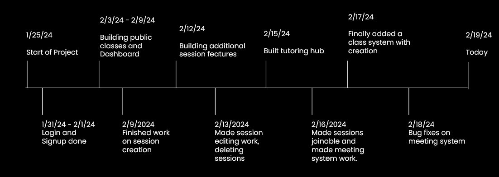

## Preamble:
This repository is the full source code for a tutoring/educational service that we called Loom for the 2024 Nevada TSA State Conference.

## 1a. Our Problem
Quality education was disrupted by COVID-19 in the United States, with American students losing several months of learning and opportunities to thrive.

## 1b. Our Solution
A peer-to-peer tutoring application and learning application through classes to be able to teach students new concepts and help them with their doubts.

## 2. Results
<hr>
<div align="center">
  We ended up getting third place for our project in the state conference, leading to us going to nationals. This entire project had taken over three works to code and finish coding, but it was all worthwhile.

  Hope to see you all at nationals!
</div>

## 3. Development Timeline


## 4. How to setup
First, get an API key from Whereby, by getting an embedded account. Then put that into the WHEREBY_API for the API Key.

Make a JWT_Secret Key as a password for production and put that into .env

Same for the DATABASE_URL parameter. Go to cockroach db and get a connection string.

Then, run
```
npx prisma migrate dev; npm run dev
```

Then you have setup the application!

## 5. Sources
https://www.brookings.edu/articles/the-alarming-state-of-the-american-student-in-2022/
https://www.allgreatquotes.com/quote-42358/
